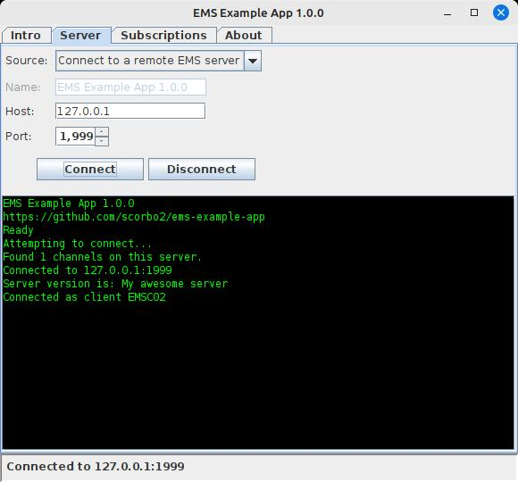
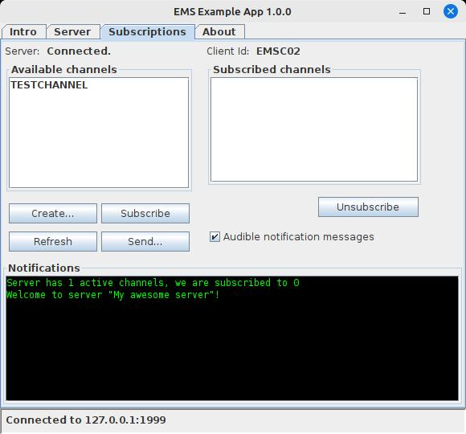
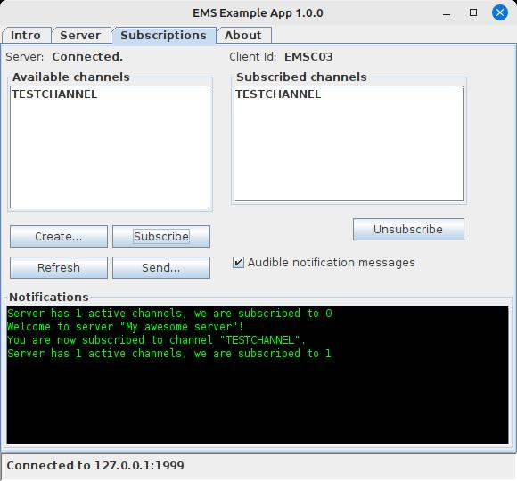
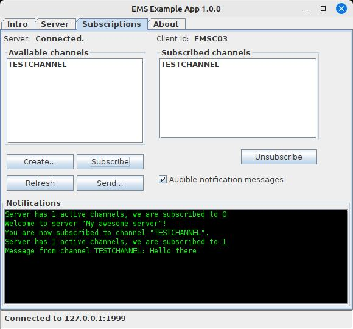

# ems-example-app

## What is this?

This application serves as an example of some of the things you can do with the 
[EMS library](https://github.com/scorbo2/ems). Specifically, this example app
shows how to extend `EMSClient` and add a bunch of custom command handlers to
dynamically add functionality to an `EMSServer`.

The challenge for this app is to create a very miniature, ultra-lightweight
version of a Kafka-style message broker. That is, we will spin up an `EMSServer`
that can support client-defined "channels" that can be subscribed to.
Clients can then send a message to a specific channel, and any other connected
client that is subscribed to that channel will receive a notification. This
basic design could be used to build something like a group chat app, or
a message broker for communication between multiple Java applications running
on various machines on the same network.

The app will provide two interfaces: a command-line interface for an extremely
lightweight experience, or a Java Swing UI for a more user-friendly approach.

## How do I get it?

Cloning the repo and building with Maven would be the most straightforward approach.
Or import the project into your favorite IDE and run from there.

```shell
git clone https://github.com/scorbo2/ems-example-app.git
cd ems-example-app
mvn package
cd target
java -jar ems-example-app-1.0.0.jar -h
```

## Running the CLI

The CLI has many options for either starting up a local EMS server, starting up
an EMS client to connect to an EMS server, or specifically starting an 
EMS subscriber (a special kind of client) to listen for messages on a specific
channel. 

### Starting a local EMS server

At a minimum, you need to specify the `--startServer` parameter. This by itself
will start an EMS server with all default options:

```shell
host=localhost
port=1975
serverName=EMS Example App 1.0.0
serverSpy=false
```

We can change these defaults with command line arguments:

```shell
java -jar ems-example-app-1.0.0.jar --startServer \
    --host 127.0.0.1 --port 1999 --serverSpy \
    --serverName "My awesome server"
```

The above will start up a server with a custom name of `My awesome server` on
port 1999 and bind it to `127.0.0.1`. We also specify the `serverSpy` option
to greatly enhance the log output that we will receive.

#### Okay, the server is up... now what?

In another terminal, you can use the command line to start up a client to connect
to the server that you are now running:

```shell
java -jar ems-example-app-1.0.0.jar --startClient
```

The `startClient` argument by itself will assume all the defaults for hostname 
and connection port. We can use the same `--host` and `--port` arguments to
change that. Once connected, you can type `?` to get help on available commands.
For example, let's try the `ABOUT` command to get the server name:

```shell
2025-03-19 11:19:07 P.M. [INFO] EMS Example App 1.0.0 starting up...
2025-03-19 11:19:07 P.M. [INFO] Starting up an EMS client connecting to "127.0.0.1:1999"...
2025-03-19 11:19:07 P.M. [INFO] Connected. Type "quit" to disconnect or "?" for help.
>ABOUT
My awesome server
```

Great! We connected to the server and we were able to confirm that our custom
server name was set. Now what?

### Subscribing to channels and receiving messages

Let's open a third terminal and start a subscriber so we can listen for events.
We use the `startSubscriber` argument along with the `channel` argument.
It's okay that we're specifying a channel that doesn't exist yet:

```shell
$ java -jar ems-example-app-1.0.0.jar \
    --host 127.0.0.1 --port 1999 \
    --startSubscriber --channel TestChannel
2025-03-19 11:22:13 P.M. [INFO] EMS Example App 1.0.0 starting up...
2025-03-19 11:22:13 P.M. [INFO] Starting up an EMS subscriber connecting to "127.0.0.1:1999"...
2025-03-19 11:22:14 P.M. [INFO] Subscribing to channel "TestChannel"... 
2025-03-19 11:22:14 P.M. [INFO] You are now subscribed to channel: TestChannel
2025-03-19 11:22:14 P.M. [INFO] Listening for messages. Type "quit" to stop listening.
2025-03-19 11:22:14 P.M. [INFO] Anything else typed here will be broadcast to that channel.
```

Okay, we are connected yet again, but this time we have subscribed to a
channel named `TestChannel`, which was automatically created for us. We are the
only subscriber to this channel.

Let's go back to the second terminal, the one where we connected as a regular
client. Here, we can use the `SEND` command to send a message to the new channel:

```shell
SEND:TestChannel:Hello there
```

Now return to your subscriber terminal, and we can see the result:

```shell
2025-03-19 11:22:14 P.M. [INFO] Anything else typed here will be broadcast to that channel.
2025-03-19 11:23:39 P.M. [INFO] Hello there
```

We have successfully sent a message on our channel and verified that the subscriber
received it. With this basic mechanism, we can set up socket communication between Java
apps, as long as the target host and port is reachable from our machine.

But, working with the EMSClient by typing out commands in the exact format and
structure that EMS expects is a little painful. Is there an easier way we
can work with this system?

## I don't like CLI, give me a GUI!

We can invoke the jar with the `startGui` argument to skip the whole command line
thing and go straight to a user-friendly GUI:



On the Server tab we can opt to either start up a local EMS server, or connect
to an existing one. Since we already have one running from the CLI section
above, let's just connect to it. Here we see a successful connection, and
again we see our custom server name of `My awesome server`.

Let's visit the Subscriptions tab and make sure we can see the channel
that we created in the CLI section above:



Yup, it's in the `Available channels` list as we might expect. Let's select
it in that list and hit the `Subscribe` button to bring it over to the
`Subscribed channels` list:



Okay, the `Subscribed channels` list now contains our test channel, and we get confirmation
in the notification area at the bottom that we are now subscribed. Let's
go back to our client terminal and type the same `SEND` command again:

```shell
SEND:TestChannel:Hello there
```



Success! We hear the notification bell, and we see the message appears
in our notification area. 

Spinning up multiple instances of this UI, or multiple subscriber terminals
with the CLI, allows us to test sending and receiving of messages
via the EMS server that we created. 

## Javadocs and source

Reading through the javadocs and looking through the source of this example
app will give you an idea of how you can customize EMSServer and EMSClient
for facilitating communication between Java applications.

## Security

To repeat the disclaimer from the EMS code itself: EMS is **not recommended
for production use**. This is a toy project that I wrote to learn more about
threading and socket programming in Java, and I found the result moderately
useful between Java applications running on a secure local network. It's easy
to implement and easy to customize, so it's fine for simple purposes.
If security is a concern, **don't use EMS**. Just use REST instead.

## License

EMS and this example app are made available under the MIT license: https://opensource.org/license/mit

## Revision history

EMS was written in 2023 but was not made publicly available on github until 2025. 
The demo app described in this README was adapted from the one that was originally
written in 2023. 
